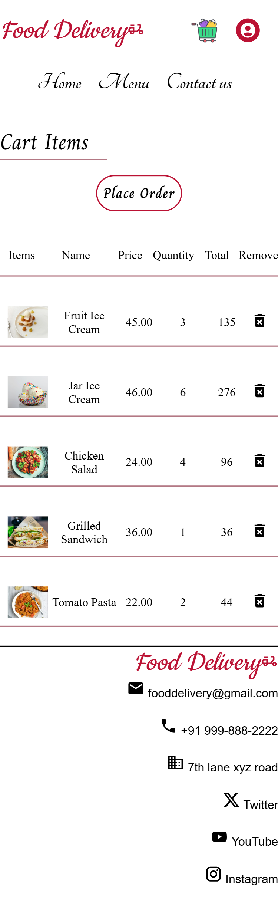
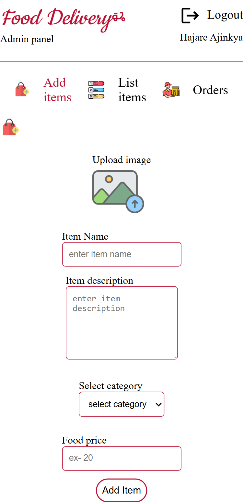

# Project Name: FoodDelivery

## Overview

It is a food delivery web application that enables customers to browse the menu, place orders, track their order history, and receive email confirmations for successful payments. The platform is built using **React.js**, **Material-UI**, **Node.js**, and **PostgreSQL**. 

The project also includes an **Admin Panel** for menu management and customer order tracking.

Fully responsive food delivery web application designed for mobile and desktop.

---

## Features
 
### **Customer Features**
- **User Registration and Login**: Secure user authentication with password encryption using salting rounds.
- **Food Menu Browsing**: View and filter menu items by category.
- **Cart and Order Placement**: Add items to the cart and place orders.
- **Order Tracking and History**: Track order status and view order history.
- **Email Notifications**: Customers receive an email confirmation upon successful payment.
- **QR Code Integration**: Scan the QR code to download the app from the Apple App Store or Google Play Store.

### **Admin Features**
- **Menu Management**: Add, or delete menu items from the admin panel.
- **Order Status Updates**: Update the order status for customer orders.

### **Additional Features**
- **Session Management**: Secure session handling for authenticated users.

---

## Technologies Used
- **Frontend**: React.js, Material-UI
- **Backend**: Node.js, Express.js
- **Database**: PostgreSQL

---

## Screenshots

### Desktop view
- Home page
    

- Cart page
    

- Order history
    

- Payment 
    

- Admin add items
    

- Admin list items
    

- Admin order page
    

### Mobile view

- Home page
    

- Cart page
    

- Admin order page
    

- Admin list items
    
    
- Admin add items
    
